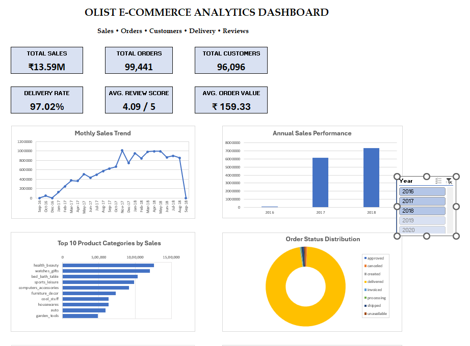

# Olist E-Commerce Analytics

## End-to-End Data Analyst Portfolio Project

An end-to-end E-commerce analytics project using the **Olist Brazilian
E-Commerce dataset**, built to demonstrate the complete workflow from
raw transactional data to validated business insights and an
executive-style Excel dashboard.

The project analyzes **sales, orders, customers, products, sellers,
payments, delivery performance, customer reviews, and freight costs**
using **MySQL, Excel Power Query, Excel Power Pivot, and DAX**.

The emphasis is not only on producing KPIs, but on **understanding data
grain, validating relationships, preventing aggregation errors, and
translating analytical results into meaningful business
recommendations**.

------------------------------------------------------------------------

## Dashboard Preview



------------------------------------------------------------------------

### 📊 Excel Dashboard

[Download the Excel Dashboard (.xlsx)](https://drive.google.com/uc?export=download&id=1foH7TUPf1jipeb-yUJnoyJuv6CK74rIJ)

------------------------------------------------------------------------

## What This Project Demonstrates

This project answers questions such as:

-   Is the business growing?
-   Which categories drive sales?
-   Where are customers concentrated?
-   How strong is delivery performance?
-   How satisfied are customers?
-   How significant are freight costs?
-   What customer and seller dimensions should be investigated further?
-   What business actions follow from the analysis?

------------------------------------------------------------------------

## Business Problem

Raw E-commerce transaction data does not directly reveal business
performance or operational opportunities.

The project evaluates:

-   Sales and order trends
-   Product/category performance
-   Customer concentration and behavior
-   Delivery and fulfillment performance
-   Customer satisfaction
-   Freight/logistics costs
-   Repeat customers, cohorts, and RFM-style customer value
-   Seller and payment patterns

------------------------------------------------------------------------

## Analytical Approach

**Raw CSVs → MySQL → QC & validation → SQL business analysis → Power
Query → Power Pivot model → DAX → PivotTables/PivotCharts → Dashboard →
Insights & recommendations**

### MySQL

Used for:

-   Database/table creation
-   Data imports
-   Validation and row-count checks
-   Joins and aggregations
-   Sales/category analysis
-   Payment analysis
-   Customer repeat/cohort/RFM analysis
-   Seller analysis
-   Review/delivery analysis
-   Data-quality checks

### Excel Power Query

Used for:

-   Data preparation
-   Transformation
-   Loading data into the analytical model

### Excel Power Pivot + DAX 

Used for:

-   Relational data modeling
-   KPI calculations
-   Dynamic measures
-   Time-based analysis
-   Dashboard reporting

### Excel Dashboard

Built with:

-   PivotTables
-   PivotCharts
-   Data Model measures
-   Dynamic KPI cells using `CUBEVALUE`

------------------------------------------------------------------------

## Data Model & Analytical Grain

The project uses nine Olist datasets:

-   Customers
-   Orders
-   Order Items
-   Payments
-   Reviews
-   Products
-   Sellers
-   Product Category Translation
-   Geolocation

### Important Modeling Decisions

**Customer identity:** `customer_unique_id` is used for actual
customer-level analysis rather than treating every `customer_id` record
as a separate customer.

**Order-item grain:** `order_item_id` is unique only within an order, so
the correct item-level identifier is `(order_id, order_item_id)`.

**Sales definition:** Product sales are calculated from
`order_items.price`.

**Freight definition:** Freight is calculated separately from
`order_items.freight_value`.

**Total revenue:** Product sales + freight.

**Payment logic:** Raw payment rows are not directly combined with
item-level sales without aggregation because multiple payment rows can
multiply transactional values.

**Review logic:** Review analysis uses order-level/deduplicated logic
where necessary so one review is not incorrectly counted once per order
item.

These decisions were validated through explicit QC checks.

------------------------------------------------------------------------

## Key Results

  KPI                                    Result
  -------------------------- ------------------
  Product Sales                     **₹13.59M**
  Orders                             **99,441**
  Unique Customers                   **96,096**
  Delivered Orders                   **96,478**
  Delivery Rate                      **97.02%**
  Average Review Score             **4.09 / 5**
  Average Delivery Time        **\~12.50 days**
  Average Order Value               **₹159.33**
  Freight                            **₹2.25M**
  Freight / Product Sales           **\~16.6%**
  2017 → 2018 Sales Growth            **\~20%**

The strongest monthly product-sales result was approximately **₹1.01M in
November 2017**.

> **Currency note:** Olist is a Brazilian dataset and the source
> monetary values are in Brazilian Real (BRL). The dashboard displays
> `₹` as a presentation convention in this portfolio version; the
> underlying analytical values are unchanged.

------------------------------------------------------------------------

## Key Business Insights

### 1. Strong Sales Growth {#1-strong-sales-growth}

Product sales reached approximately **₹13.59M**, with approximately
**20% growth from 2017 to 2018**.

**Action:** Protect high-performing products, categories, and periods
through inventory and marketing planning.

### 2. Geographic Concentration {#2-geographic-concentration}

São Paulo represents approximately **43% of unique customers**, while
the top three states represent approximately **69%**.

**Action:** Maintain strong logistics coverage in core markets while
expanding acquisition in underrepresented regions.

### 3. Strong Customer Satisfaction {#3-strong-customer-satisfaction}

The average review score is **4.09/5**, with approximately **77% of
reviews rated 4 or 5 stars**.

**Action:** Investigate low-rated orders by seller, category, and
delivery performance to identify root causes.

### 4. Strong Delivery Completion {#4-strong-delivery-completion}

**97.02% of orders reached delivered status**, with average delivery
time of approximately **12.50 days** for valid delivered orders.

**Action:** Maintain high fulfillment completion while reducing delivery
delays and monitoring their relationship with customer satisfaction.

### 5. Freight Cost Exposure {#5-freight-cost-exposure}

Freight totaled approximately **₹2.25M**, or roughly **16.6% of product
sales**.

**Action:** Monitor freight alongside sales by month, region, seller,
and order characteristics.

### 6. Category Concentration {#6-category-concentration}

**Health & Beauty, Watches & Gifts, and Bed & Bath Table** are among the
strongest categories by product sales.

**Action:** Prioritize high-performing categories while improving
visibility and promotions for lower-performing categories.

------------------------------------------------------------------------

## Customer & Advanced Analysis {#customer--advanced-analysis}

The SQL analysis goes beyond descriptive KPIs and includes:

-   Repeat-purchase analysis
-   Cohort/retention analysis
-   RFM-style customer segmentation
-   RFM segment revenue analysis
-   Seller analysis
-   Payment analysis
-   Review/category analysis
-   Delivery and repeat-customer relationship analysis

This provides a path from **"what happened?"** to **"which customers,
products, sellers, or operational factors should be investigated?"**

------------------------------------------------------------------------

## Data Quality & Analytical Validation {#data-quality--analytical-validation}

A major part of the project was validating whether the analysis itself
was trustworthy.

Examples include:

-   Correctly identifying the order-item grain
-   Using `customer_unique_id` for customer counts and repeat analysis
-   Checking payment coverage against total orders
-   Preventing payment/order-item join multiplication
-   Preventing review duplication through item-level joins
-   Validating row counts and completeness
-   Using calendar-month logic for cohort calculations
-   Separating product sales from payment values
-   Keeping freight separate from product sales until the appropriate
    revenue calculation

This is an important part of the project because **a technically correct
SQL query can still produce a wrong business answer if table grain and
relationships are misunderstood**.

------------------------------------------------------------------------

## Dashboard

The final Excel dashboard contains:

-   **Monthly Sales Trend**
-   **Annual Sales Performance**
-   **Top 10 Product Categories by Sales**
-   **Order Status Distribution**
-   **Top 10 States by Customers**
-   **Review Score Distribution**
-   **Average Delivery Time by Month**
-   **Monthly Sales vs Freight**

### KPI Cards

-   Total Sales
-   Total Orders
-   Total Customers
-   Delivery Rate
-   Average Review Score
-   Average Order Value

The KPI cards and PivotCharts are connected to the Excel Data Model and
use dynamic measures rather than manually entered values.

------------------------------------------------------------------------

## Tools & Technologies {#tools--technologies}

-   **MySQL** --- SQL analysis, joins, aggregation, validation, business
    questions
-   **Excel Power Query** --- data preparation and transformation
-   **Excel Power Pivot** --- relational data modeling
-   **DAX** --- dynamic KPI and analytical measures
-   **PivotTables & PivotCharts** --- analysis and visualization
-   **Microsoft Excel** --- dashboard and reporting

------------------------------------------------------------------------

## Project Structure

``` text
Olist_Data_Analytics/
│
├── README.md
│
├── Excel/
│   ├── Archive/
│   └── Olist_Analytics_Dashboard.xlsx
│
├── SQL/
│   └── Olist_Analytics_SQL.sql
│
├── Documentation/
│   └── Project_Documentation.md
│
├── Insights/
│   └── Business_Insights.md
│
└── ScreenShots/
    ├── 01_Dashboard.png
    ├── 02_Data_Model.png
    └── 03_Project_Documentation.png
```

------------------------------------------------------------------------

## Detailed Project Files

-   **[Project Documentation](Documentation/Project_Documentation.md)**
    --- methodology, data model, analytical logic, DAX, QC, dashboard
    explanation, and portfolio takeaways.
-   **[Business Insights](Insights/Business_Insights.md)** --- detailed
    findings, business interpretation, assessment, and prioritized
    recommendations.
-   **[SQL Analysis](SQL/Olist_Analytics_SQL.sql)** --- complete MySQL
    workflow and business-analysis queries.

------------------------------------------------------------------------

## Skills Demonstrated

-   SQL
-   Data Cleaning & Validation
-   Relational Data Modeling
-   Data Grain & Join Reasoning
-   Complex Joins & Aggregation
-   KPI Development
-   DAX
-   Power Query
-   Power Pivot
-   Excel Dashboard Development
-   Time-Series Analysis
-   Customer Analysis
-   Cohort & Retention Analysis
-   RFM Analysis
-   Product & Category Analysis
-   Seller Analysis
-   Payment Analysis
-   Delivery/Operational Analysis
-   Review/Customer Experience Analysis
-   Data Storytelling
-   Business Recommendations

------------------------------------------------------------------------

## Final Takeaway

Olist shows **strong overall business health**, supported by sales
growth, high delivery completion, and positive customer satisfaction.

The main opportunities are to:

-   optimize logistics and freight costs,
-   investigate lower-rated customer experiences,
-   manage delivery-time performance,
-   and reduce dependence on geographically concentrated markets.

More importantly, this project demonstrates the analyst mindset behind
the numbers: **understand the grain, validate the relationships, define
the metric correctly, test the result, and then ask what business
decision the analysis can support.**
